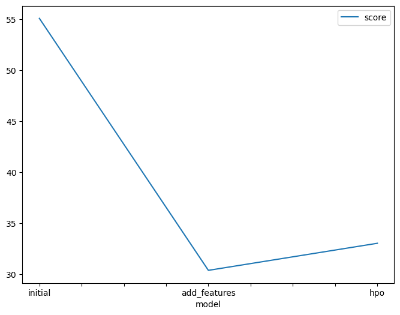
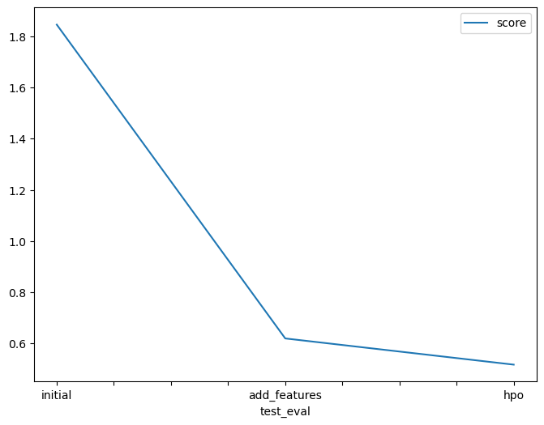

# Report: Predict Bike Sharing Demand with AutoGluon Solution
#### NAME HERE

## Initial Training
### What did you realize when you tried to submit your predictions? What changes were needed to the output of the predictor to submit your results?

To achieve the intended model execution, I debugged syntax errors and consulted additional documentation. My initial scores were above 1.8, but with these adjustments, I was able to achieve scores below 0.5.

### What was the top ranked model that performed?

My top score was achieved my the completing the third run with hyperparameters. The score was 0.51743.

## Exploratory data analysis and feature creation
### What did the exploratory analysis find and how did you add additional features?

I divided the datetime in month, day, year and hour for adding additional features. On top of that, I also transformed the season and weather features to categorical.

### How much better did your model preform after adding additional features and why do you think that is?

To enhance the model's ability to analyze seasonal patterns in the data, which can be valuable for a regression model, I chose to separate the date. By incorporating additional features, we can enhance the accuracy of predicting the target value.

## Hyper parameter tuning
### How much better did your model preform after trying different hyper parameters?

Hyper parameter tuning was useful in some cases, and in my case it did improve the performance of the model, some configurations were useful others the model performance.

### If you were given more time with this dataset, where do you think you would spend more time?

To gain a deeper understanding of the dataset, I would have conducted a comprehensive exploratory data analysis. Additionally, I would have delved further into researching the optimal hyperparameters for the model.

### Create a table with the models you ran, the hyperparameters modified, and the kaggle score.
|model|hpo1|hpo2|hpo3|score|
|--|--|--|--|--|
|initial|default_vals|default_vals|default_vals|1.84575|
|add_features|default_vals|default_vals|default_vals|0.6198|
|hpo|XGB|GBM: num_boost_round: 100||0.51743|

### Create a line plot showing the top model score for the three (or more) training runs during the project.

### Create a line plot showing the top kaggle score for the three (or more) prediction submissions during the project.

## Summary

This project allowed me to apply the concepts learned in this unit of the course. By utilizing the skills I gained, I developed a machine learning regression model using the AutoGluon framework. I thoroughly enjoyed the project, as it not only expanded my knowledge but also resulted in a commendable Kaggle score.
